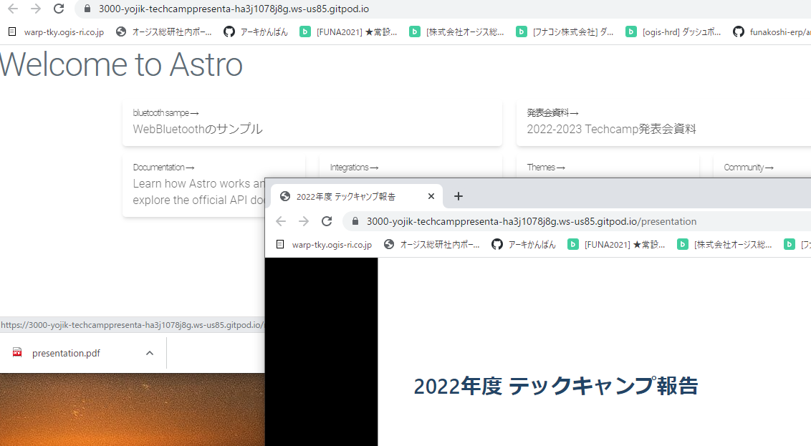
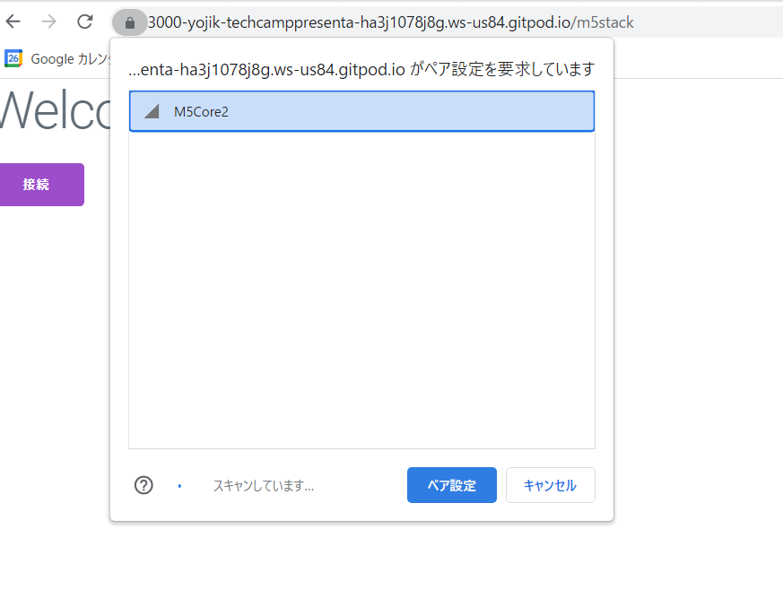
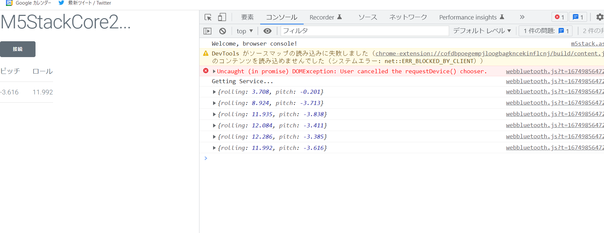
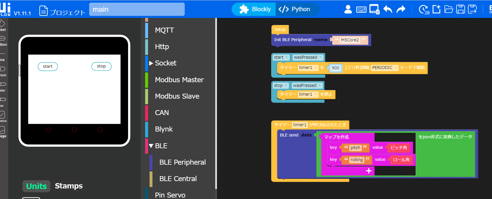
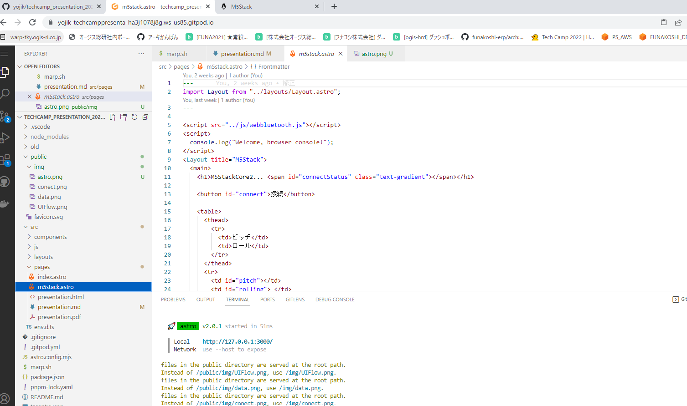

# 2022年度 テックキャンプ報告

<br>
<br>

ES1-1 菅野 洋史

--- 

# 今期テーマ

今期はマルチテーマ

- テーマ1: VR/ARプレゼンツール  <停止>
- テーマ2: ブラウザIoT <作業中>
- テーマ３: ブラウザで機械学習
---

## 共通の問題設定

### 1.いつでもどこでも開発できて、

### 2.手軽に試せるような最新技術検証

ブラウザで動く技術にこだわる

---
# テーマ1: VR/ARプレゼンツール

## 停止中

- 今プレゼンしてるMozilla Hubs で良いのではという気持ちが高まっため
- 調査していたaframeというフレームワークがMozillaHubsの実装に利用されています。

---
# テーマ2: ブラウザIoT

----
# モチベーション

IoT x クラウド に疑問をもっていた。

- 提供側サービス終了により照明のON/OFFができなくなる事例
- AWSのトラブルによりレンタル自転車のロックがはずれなくなる事例
- Goog IoT Coreがサービス終了

---

## 例: 目の前の機器の情報を読み出したい

AWS等を使うと

1. アプリがMMQTプロトコルでクラウド上のAWS IoTに情報プッシュして、
2. AWS kinesisでイベントを分類
3. Lambdaで処理をしDynamoDBに保存
5. アプリからAPI経由で情報を要求し
6. LambdaがDynamoDBから情報を取り出して返却

<br>
<br>

(もちろん本当に必要なユースケースもあるが、、)


---
# 手軽にIoTを試したい

- クラウドを否定するわけではないが、、、
- 手元のある機器と簡単につないでIoTプロトタイピングしたい
- 開発環境はクラウドで、動作環境は実機でアプリを作ってみる
- ブラウザで動く技術にこだわりたい
  - 特定の環境にロックインされたくない


---

# どんなアプリをつくった?

1. Webサイトの1ページにアクセスする
2. そのページでBluetoothペアリングを行うと近くに置いてあるM5Stackにつながる
3. M5Stackのセンサ情報がwebページにレンダリングする
4. ついでに、ページに入力したメッセージがM5Stackに表示される

---
# 構成要素

- Astro.js(静的サイトジェネレータ)を利用してWebサイト作成
- WebBluetooth でM5Stackにアクセスし,情報交換する
- M5StackのプログラミングはUIFlowで実装
--- 


### Webサイト上にアプリが乗っている

Astro.jsというCMSで作成したWebサイトに、このプレゼン資料自体もアプリもすべて突っ込んでます。



---
### 接続




---
### M5Stackのジャイロデータをリアルタイムに表示

手元でM5Stackを回転させると反映される




---
### UIFlowプログラム




---
### 開発環境もWeb上のコンテナで




---
# テーマ3: ブラウザで機械学習

お遊び程度
- Colaboratory でStable Diffusion による画像生成は実施  
- ChatGPT(というよりもOpenAI)クライアントをdenoで作成
- ChatGPTと外部リソースを組み合わせるLangChainを試してみる
- 
--- 

# LangChain 

- OpenAIは本質的に文字列のパターンから、ありそうな返答を作るだけなので意外と嘘つき
- ちょっとした計算でも「それっぽい数字」を出しているだけなので嘘をつく
  LangChainではOpanAIに質問した回答を他のシステムに流し込み、正しい結果を得たりすることができる
- また名前のとおり、質疑の流し込みを何段も積み重ねることができる


---
# サンプル

日本語の質問をOpenAIに流し込んで、Pythonに変換し、その処理結果を取得する。

```
# LLMの準備
llm = OpenAI(temperature=0.9)

# 数式eval
llm_math_chain = LLMMathChain(llm=llm, verbose=True)

# 計算をおこなうツール
# 計算を行うような文書パターンが出てきたらこちらで代行する
tools = [
    Tool(
        name="Calculator",
        func=llm_math_chain.run,
        description="useful for when you need to answer questions about math"
    )
]
llm = OpenAI(temperature=0)
agent = initialize_agent(tools, llm, agent="zero-shot-react-description", verbose=True)
```

---
# 普通のOpenAIなら


```
print(llm("1000円をもって買い物にでかけました。450円の本を買い、135円のジュースを2本買いました。おつりはいくらですか"))
```

<br>

## 自信たっぷり間違える
```
残りは425円です。
```
---
# LangChainなら

質問から数式を組み立てるところまではOpenAIの言語モデルを使い、その式をPythonで実行する

--- 
# 結局間違っている！！！！！


計算しようとして間違えてる心意気は伝わる。。


```
agent.run("1000円をもって買い物にでかけました。450円の本を買い、135円のジュースを2本買いました。残りはいくらですか")
```

```
> Entering new AgentExecutor chain...
 I need to calculate how much money is left
Action: Calculator
Action Input: 1000 - 450 - (135 * 2)   

> Entering new LLMMathChain chain...
1000 - 450 - (135 * 2)  # ここまでやれてるのに。。
Answer: 220       # 結局間違える。。
> Finished chain.

Observation: Answer: 220
Thought: I now know the final answer
Final Answer: 残りは220円です。

> Finished chain.
残りは220円です。
```


---
# まとめ

雑多な内容なのでまとめ辛いですが、、

#### WebBlutooth
- 「開発をクラウド」「動作はエッジ」ですべてブラウザ上でアプリを作成した
- クライドを利用しつつ、クラウドに利用されない気持ち！ 

##### LangChain
- 機械学習本体にはもう手をつけられる時代ではない
- どうやって組み合わせてツールとして成立させるか